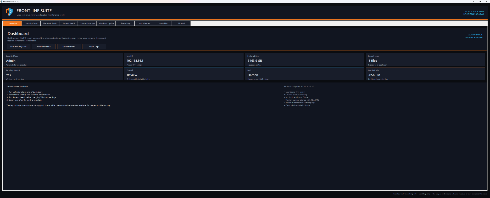

# Frontline Suite

**Local Security, Network, and System Maintenance Toolkit**  
Frontline Tech Consulting, LLC  
Version **4.4.0**

Frontline Suite is a Windows desktop utility for local security checks, Microsoft Defender actions, DNS hardening, local network review, firewall rule review, Windows maintenance, startup review, event log review, junk cleanup, hosts file management, and customer-facing checkup reporting.

This package is designed as a **no-SDK Windows build**. It uses the .NET Framework compiler that is already included with Windows, so you do not need to install the full .NET SDK.

---

## Screenshot



The dashboard gives users a quick first look at the app status, admin mode, local IP, system drive space, recent logs, DNS actions, firewall review, and recommended workflow. Version 4.4.0 keeps this dashboard-first layout and adds a dedicated **Checkup Report** tab.

---

## What's new in 4.4.0

| Change | Why it matters |
|---|---|
| **New Checkup Report tab** | Creates a customer-facing baseline report before any repair or cleanup work begins. |
| **TXT and HTML report export** | Saves a technician-friendly text report and a cleaner customer-facing HTML report in the local logs folder. |
| **Dashboard Create Report button** | Makes the report workflow part of the first screen instead of hiding it in an advanced tab. |
| **Named tab indexes added** | Dashboard quick-action buttons no longer rely on fragile hardcoded tab numbers. |
| **Report recommendations** | Adds simple next-action guidance for admin mode, pending reboot, low disk space, and Defender status. |
| **Version numbers aligned** | README and source code now both show version 4.4.0. |

---

## Main sections

| Tab | What it does |
|-----|-------------|
| **Dashboard** | Quick status cards for admin mode, local IP, system drive free space, recent logs, pending reboot, DNS, firewall, and refresh time. Includes quick-action buttons for common workflows. |
| **Checkup Report** | Generates a branded Frontline Checkup Report with system, storage, network, DNS, Defender, firewall, local logs, and recommended next-action sections. Saves both TXT and HTML versions. |
| **Security Scan** | Microsoft Defender status, signature update, Quick Scan, Full Scan, Custom Folder Scan, DISM RestoreHealth, SFC /scannow, Recommended Sweep, Protection History, command guide, and logs folder. |
| **Network Shield** | DNS management, local /24 network scan, device inventory with new-device detection, CSV export, TXT export, and local network review. |
| **System Health** | Disk space, RAM, CPU, OS information, uptime, battery state, pending reboot check, and recent Event Log errors. |
| **Startup Manager** | Lists startup entries from HKCU and HKLM Run keys, supports enable/disable actions, and exports startup data. |
| **Windows Update** | Update history, last update date, pending reboot check, Windows Update reset actions, cache cleanup, and service status. |
| **Event Log** | Filter System, Application, and Security logs by level and count. Click events for detail and export results to log. |
| **Junk Cleaner** | Preview and clean common temporary file locations. Files in use are skipped automatically. |
| **Hosts File** | View, edit, analyze, back up, reset, and flush DNS for the Windows hosts file. |
| **Firewall** | Load and filter Windows Firewall rules, review details, enable/disable rules with confirmation, and export the rule list. |

All logs and generated reports are saved to a shared local `logs\` folder inside the install directory.

---

## Checkup Report output

The **Run Checkup Report** button creates:

```text
logs\frontline_checkup_report_YYYYMMDD_HHMMSS.txt
logs\frontline_checkup_report_YYYYMMDD_HHMMSS.html
```

The report includes:

- Computer name, user, timestamp, and admin mode
- Windows version, architecture, uptime, and pending reboot status
- System drive free space
- Primary IPv4 address, active adapters, and DNS servers
- Microsoft Defender summary
- Windows Firewall profile summary
- Local log inventory
- Recommended next actions
- Suggested Frontline workflow

The report is a local maintenance snapshot. It does not prove compliance, guarantee that malware is absent, or replace a full security assessment.

---

## How to build and install

### Option A — One step

Double-click:

```bat
INSTALL.cmd
```

This will:

1. Build `FrontlineSuite.exe` using the Windows .NET Framework compiler
2. Copy the app to `%LOCALAPPDATA%\Frontline Tech Consulting\Frontline Suite\`
3. Create a Start Menu shortcut
4. Launch the app

### Option B — Build only

Double-click:

```bat
BUILD_No_DotNet_SDK.cmd
```

Output:

```text
publish\FrontlineSuite.exe
```

Run the EXE from the `publish\` folder.

---

## Requirements

- Windows 10 or Windows 11
- .NET Framework 4.x, already included with Windows
- Administrator mode for full functionality

Administrator mode is required for DNS changes, Defender scans, DISM, SFC, startup entry changes, hosts file changes, and firewall rule changes. The Checkup Report can run in Standard Mode, but some report sections may be limited.

---

## Folder layout

```text
FrontlineSuite\
  src\
    FrontlineSuite.cs
    app.manifest
  assets\
    frontline_logo.ico
    frontline_logo.png
  docs\
    screenshots\
      frontline_suite_dashboard_v4_3.png
    Frontline_Malware_Scan_Commands.txt
    Frontline_Network_Shield_Commands.txt
    Frontline_Checkup_Report_Notes.txt
  BUILD_No_DotNet_SDK.cmd
  INSTALL.cmd
  README.md
  DESIGN_NOTES_v4_4.md
```

---

## Responsible use

- Only scan computers and networks you own or have permission to assess.
- DNS, startup, hosts file, Defender, DISM, SFC, and firewall changes may require administrator rights.
- Logs and checkup reports are stored locally. The app does not send logs to Frontline Tech Consulting or any third party by itself.
- The network scan is limited to the local /24 subnet for safer small-network review.
